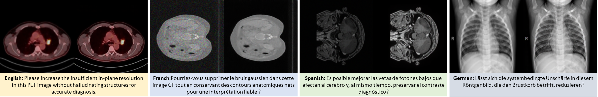
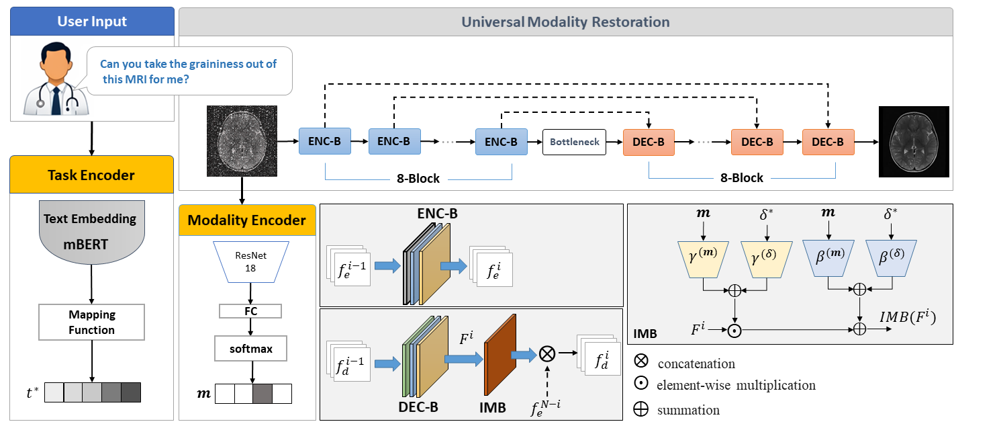

# if you see this message, It means we are uploading our source code and checkpoints. Please wait....

# InstructMedIR
## All-in-One Medical Image Restoration via Human-Written Instruction

### Authors: Ako Bartani, Fatemeh Daneshfar, Pietro Lio
### Published in: MICCAI2026



#### Medical image restoration (MedIR) is essential for enhancing image quality in clinical workflows; however, most existing approaches are tailored to individual tasks or modalities, limiting their scalability and practical applicability. Furthermore, current multi-task MedIR frameworks commonly rely on task-specific heads, routing strategies, or handcrafted conditioning mechanisms, which hinder generalization across heterogeneous modalities and reduce model interpretability. With these motivations, we propose InstructMedIR, an all-in-one MedIR that leverages human-written instructions and discrete modality mask as guiding signals to perform multiple restoration tasks across heterogeneous modalities. InstructMedIR is equipped a contrastive-based task encoder that leverages human-written instructions to specify the user's desired restoration task. In parallel, InstructMedIR uses a modality encoder to predict a modality mask of input medical image. Subsequently, both generated signals are used to guide a universal encoder-decoder-based restoration network augmented by Feature-wise Linear Modulation layers. Experimental results demonstrate outperforms across multiple MedIR tasks (e.g., denoising, super-resolution, and deblurring) and modalities (e.g., MRI, CT, PET, and X-Ray) compared to existing multi-task restoration baselines.	



## Requirements
```
-PyTorch (CUDA-enabled for GPU training)
-torchvision
-numpy, scipy, pillow
-opencv-python
-cikit-image
-tqdm, matplotlib
```

## Dataset preparation
We used four imaging modalities MRI, CT, X-ray, and PET. The 'modality dataset' folder represents our dataset structure as,

```
modality dataset/
├── train/
│   ├── CT/
│   └── MRI/
│   └── PET/
│   └── X-Ray/
└── test/
│   ├── CT/
│   └── MRI/
│   └── PET/
│   └── X-Ray/
```
Training dataset is available at: [Download Link](https://drive.google.com/file/d/1-bdD5ef3n8mRjlyO7WGz0eA5j8RoB7Ap/view?usp=sharing). 
Moreover, you can find human instructions (train and test) and frozen task representation in the 'data' folder.

## Train Model
If you want to train the model using your dataset, we recommend that retrain the both modality encoder and task encoder model on new data. To this end, run the "preTrain_ModalityEncoder.py" and "preTrain_TaskEncoders.py" using new data. Next, run the "train.py" on new dataset and ensure that in the datase/config.py:
```
LOAD_checkpoints_modality_Encoder = False
LOAD_checkpoints_TEXT_Encoder = False
GENERATOR_LOAD_checkpoints = False
```

Otherwise, you can use pre-trained weights on defined dataset. You can download our checkpoints from: [download link](). 

Please pot downloaded files in the "checkpoints/" and ensure that in the datase/config.py: 
```
LOAD_checkpoints_modality_Encoder = True
LOAD_checkpoints_TEXT_Encoder = True
GENERATOR_LOAD_checkpoints = True
```
Also, you can change checkpoints path in the datase/config.py as,
```
IMAGE_ENCODER_checkpoints = f"checkpoints/modality_enc_4D.pth.tar"
TEXT_MODEL_checkpoints = f"checkpoints/TinyBERT_4D.pth.tar" 
URN_checkpoints = "checkpoints/URN.pth.tar"
```
## Test Model
To test model:

1: ensure that the model checkpoints are in the "checkpoints/" folder. ([download link]().)

2: in the datase/config.py:
```
LOAD_checkpoints_modality_Encoder = True
LOAD_checkpoints_TEXT_Encoder = True
GENERATOR_LOAD_checkpoints = True
```

4: run the "test.py".


## Contacts
For any inquiries contact Ako Bartani: <a href="mailto:a.bartani@uok.ac.ir">a.bartani [at] uok.ac.ir</a>
